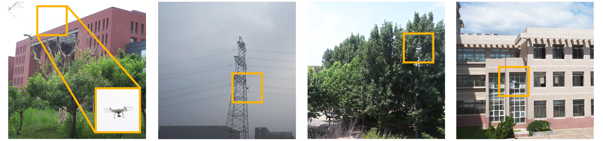

<h1> 
  <p align=center> QHNet: A Novel Quad-Head Network for Real-Time Detection of Intruding Drones </p>
<div align="center">


[](README.md)

</div>
</h1>


## Model Zoo 

<table>
  <thead align="center">
    <tr>
      <th>Model</th>
      <th>Resolution</th>
      <th>Epoch</th>
      <th>Params(M)</th>
      <th>FLOPs(G)</th>
      <th>$AP$</th>
      <th>$AP_{50}$</th>
      <th>$AP_{75}$</th>
      <th>BaiduYun Download</th>
      <th>Google Download</th>
    </tr>
  </thead>
  <tbody align="center">
    <tr>
      <td>QHNet-N</td>
      <td>640</td>
      <td>200</td>
      <td>2.8</td>
      <td>12.0</td>
      <td>57.1</td>
      <td>88.9</td>
      <td>65.9</td>
      <td><a href="https://github.com/FishAndWasabi/YOLO-MS/tree/main/configs/yoloms/yoloms-xs_syncbn_fast_8xb8-300e_coco.py">weight</a></td>
      <td>---</td>
    </tr>
    <tr>
      <td>QHNet-S</td>
      <td>640</td>
      <td>200</td>
      <td>10.4</td>
      <td>35.1</td>
      <td>60.2</td>
      <td>91.2</td>
      <td>70.1</td>
      <td><a href="https://github.com/FishAndWasabi/YOLO-MS/tree/main/configs/yoloms/yoloms-xs_syncbn_fast_8xb8-300e_coco.py">weight</a></td>
      <td>---</td>
    </tr>
    <tr>
      <td>QHNet-M</td>
      <td>640</td>
      <td>200</td>
      <td>17.9</td>
      <td>71.1</td>
      <td>62.1</td>
      <td>92.8</td>
      <td>71.4</td>
      <td><a href="https://github.com/FishAndWasabi/YOLO-MS/tree/main/configs/yoloms/yoloms-xs_syncbn_fast_8xb8-300e_coco.py">weight</a></td>
      <td>---</td>
    </tr>
    <tr>
      <td>QHNet-L</td>
      <td>640</td>
      <td>200</td>
      <td>24.0</td>
      <td>120.4</td>
      <td>63.1</td>
      <td>93.2</td>
      <td>71.9</td>
      <td><a href="https://github.com/FishAndWasabi/YOLO-MS/tree/main/configs/yoloms/yoloms-xs_syncbn_fast_8xb8-300e_coco.py">weight</a></td>
      <td>---</td>
    </tr>
    <tr>
      <td>QHNet-X</td>
      <td>640</td>
      <td>200</td>
      <td>37.1</td>
      <td>183.8</td>
      <td>64.0</td>
      <td>93.8</td>
      <td>74.3</td>
      <td><a href="https://github.com/FishAndWasabi/YOLO-MS/tree/main/configs/yoloms/yoloms-xs_syncbn_fast_8xb8-300e_coco.py">weight</a></td>
      <td>---</td>
    </tr>
  </tbody>
</table>

- Results of the mAP are evaluated on [DUT-Anti-UAV](https://cocodataset.org/#download) dataset with the input
  resolution of 640×640.


## Dependencies and Installation 

1. Clone and enter the repo.

   ```shell
   git clone https://github.com/wanq501/QHNet.git
   cd QHNet
   ```

2. Run `install.sh`.

   ```shell
   pip install -e .
   ```

3. Activate your environment!

   ```shell
   conda activate QHNet
   ```

## 👼 Quick Demo [🔝](#-table-of-contents)

```shell
python demo/image_demo.py ${IMAGE_PATH} ${CONFIG_FILE} ${CHECKPOINT_FILE} [optional arguments]

# for sam output
python demo/sam_demo.py ${IMAGE_PATH} ${CONFIG_FILE} ${CHECKPOINT_FILE} --sam_size ${SAM_MODEL_SIZE} --sam_model ${SAM_MODEL_PATH}
```

You could run `python demo/image_demo.py --help` to get detailed information of this scripts.

<details>
<summary> Detailed arguments </summary>

```
positional arguments:
  img                   Image path, include image file, dir and URL.
  config                Config file
  checkpoint            Checkpoint file

optional arguments:
  -h, --help            show this help message and exit
  --out-dir OUT_DIR     Path to output file
  --device DEVICE       Device used for inference
  --show                Show the detection results
  --deploy              Switch model to deployment mode
  --tta                 Whether to use test time augmentation
  --score-thr SCORE_THR
                        Bbox score threshold
  --class-name CLASS_NAME [CLASS_NAME ...]
                        Only Save those classes if set
  --to-labelme          Output labelme style label file
  
  --sam_size            Default: vit_h, Optional: vit_l, vit_b
  --sam_model           Path of the sam model checkpoint
```

</details>

<table>
  <tbody>
    <tr>
        <td>
            
        </td>
        <td>
            
        </td>
    </tr>
    <tr>
        <td>
            
        </td>
        <td>
            
        </td>
    </tr>
    <tr>
        <td>
            
        </td>
        <td>
            
        </td>
    </tr>
    </tbody>
</table>

## 🤖 Training and Evaluation [🔝](#-table-of-contents)

1. Training

   1.1 Single GPU

   ```shell
   python tools/train.py ${CONFIG_FILE} [optional arguments]
   ```

   1.2 Multi GPU

   ```shell
   CUDA_VISIBLE_DEVICES=x bash tools/dist_train.sh ${CONFIG_FILE} ${GPU_NUM} [optional arguments]
   ```

   You could run `python tools/train.py --help` to get detailed information of this scripts.

   <details>
    <summary> Detailed arguments </summary>

   ```
   positional arguments:
   config                train config file path

   optional arguments:
   -h, --help            show this help message and exit
   --work-dir WORK_DIR   the dir to save logs and models
   --amp                 enable automatic-mixed-precision training
   --resume [RESUME]     If specify checkpoint path, resume from it, while if not specify, try to auto resume from the latest checkpoint in the work directory.
   --cfg-options CFG_OPTIONS [CFG_OPTIONS ...]
                           override some settings in the used config, the key-value pair in xxx=yyy format will be merged into config file. If the value to be overwritten is a list, it should be like key="[a,b]" or key=a,b It also allows nested
                           list/tuple values, e.g. key="[(a,b),(c,d)]" Note that the quotation marks are necessary and that no white space is allowed.
   --launcher {none,pytorch,slurm,mpi}
                           job launcher
   --local_rank LOCAL_RANK
   ```

   </details>

2. Evaluation

   1.1 Single GPU

   ```shell
   python tools/test.py ${CONFIG_FILE} ${CHECKPOINT_FILE} [optional arguments]
   ```

   1.2 Multi GPU

   ```shell
   CUDA_VISIBLE_DEVICES=x bash tools/dist_test.sh ${CONFIG_FILE} ${CHECKPOINT_FILE} ${GPU_NUM} [optional arguments]
   ```

   You could run `python tools/test.py --help` to get detailed information of this scripts.

   <details>
    <summary> Detailed arguments </summary>

   ```
   positional arguments:
   config                test config file path
   checkpoint            checkpoint file

   optional arguments:
   -h, --help            show this help message and exit
   --work-dir WORK_DIR   the directory to save the file containing evaluation metrics
   --out OUT             output result file (must be a .pkl file) in pickle format
   --json-prefix JSON_PREFIX
                           the prefix of the output json file without perform evaluation, which is useful when you want to format the result to a specific format and submit it to the test server
   --tta                 Whether to use test time augmentation
   --show                show prediction results
   --deploy              Switch model to deployment mode
   --show-dir SHOW_DIR   directory where painted images will be saved. If specified, it will be automatically saved to the work_dir/timestamp/show_dir
   --wait-time WAIT_TIME
                           the interval of show (s)
   --cfg-options CFG_OPTIONS [CFG_OPTIONS ...]
                           override some settings in the used config, the key-value pair in xxx=yyy format will be merged into config file. If the value to be overwritten is a list, it should be like key="[a,b]" or key=a,b It also allows nested
                           list/tuple values, e.g. key="[(a,b),(c,d)]" Note that the quotation marks are necessary and that no white space is allowed.
   --launcher {none,pytorch,slurm,mpi}
                           job launcher
   --local_rank LOCAL_RANK
   ```

   </details>

3. Deployment

```shell
# Build docker images
docker build docker/mmdeploy/ -t mmdeploy:inside --build-arg USE_SRC_INSIDE=true
# Run docker container
docker run --gpus all --name mmdeploy_yoloms -dit mmdeploy:inside
# Convert ${CONFIG_FILE}
python tools/misc/print_config.py ${O_CONFIG_FILE} --save-path ${CONFIG_FILE}

# Copy local file into docker container
docker cp deploy.sh mmdeploy_yoloms:/root/workspace
docker cp ${DEPLOY_CONFIG_FILE}  mmdeploy_yoloms:/root/workspace/${DEPLOY_CONFIG_FILE}
docker cp ${CONFIG_FILE} mmdeploy_yoloms:/root/workspace/${CONFIG_FILE}
docker cp ${CHECKPOINT_FILE} mmdeploy_yoloms:/root/workspace/${CHECKPOINT_FILE}

# Start docker container
docker start mmdeploy_yoloms
# Attach docker container
docker attach mmdeploy_yoloms

# Run the deployment shell
sh deploy.sh ${DEPLOY_CONFIG_FILE} ${CONFIG_FILE} ${CHECKPOINT_FILE} ${SAVE_DIR}
# Copy the results to local
docker cp mmdeploy_yoloms:/root/workspace/${SAVE_DIR} ${SAVE_DIR}
```

- **DEPLOY_CONFIG_FILE**: Config file for deployment.
- **O_CONFIG_FILE**: Original config file of model.
- **CONFIG_FILE**: Converted config file of model.
- **CHECKPOINT_FILE**: Checkpoint of model.
- **SAVE_DIR**: Save dir.

1. Test FPS

   4.1 Deployed Model

   ```shell
   # Copy local file into docker container
   docker cp ${DATA_DIR} mmdeploy_yoloms:/root/workspace/${DATA_DIR}
   docker cp fps.sh mmdeploy_yoloms:/root/workspace
   # Start docker container
   docker start mmdeploy_yoloms
   # Attach docker container
   docker attach mmdeploy_yoloms
   # In docker container
   # Run the FPS shell
   python mmdeploy/tools/profiler.py ${DEPLOY_CONFIG_FILE} \
                                     ${CONFIG_FILE} \
                                     ${DATASET} \
                                     --model ${PROFILER_MODEL} \
                                     --device ${DEVICE}
   ```

   4.2 Undeployed Model

   ```shell
   python tools/analysis_tools/benchmark.py ${CONFIG_FILE} --checkpoint ${CHECKPOINT_FILE} [optional arguments]
   ```

2. Test FLOPs and Params

```shell
python tools/analysis_tools/get_flops.py ${CONFIG_FILE} --shape 640 640 [optional arguments]
```


## 🏗️ Supported Tasks [🔝](#-table-of-contents)

- [x] Object Detection
- [ ] Instance Segmentation (TBD)
- [ ] Rotated Object Detection (TBD)
- [ ] Object Tracking (TBD)
- [ ] Detection in Crowded Scene (TBD)
- [ ] Small Object Detection (TBD)

## 📖 Citation [🔝](#-table-of-contents)

If you find our repo useful for your research, please cite us:

```
@article{Chen2025,
  title = {YOLO-MS: Rethinking Multi-Scale Representation Learning for Real-time Object Detection},
  ISSN = {1939-3539},
  url = {http://dx.doi.org/10.1109/TPAMI.2025.3538473},
  DOI = {10.1109/tpami.2025.3538473},
  journal = {IEEE Transactions on Pattern Analysis and Machine Intelligence},
  publisher = {Institute of Electrical and Electronics Engineers (IEEE)},
  author = {Chen, Yuming and Yuan, Xinbin and Wang, Jiabao and Wu, Ruiqi and Li, Xiang and Hou, Qibin and Cheng, Ming-Ming},
  year = {2025},
  pages = {1–14}
}
```

This project is based on the open source codebase [MMYOLO](https://github.com/open-mmlab/mmyolo).

```
@misc{mmyolo2022,
    title={{MMYOLO: OpenMMLab YOLO} series toolbox and benchmark},
    author={MMYOLO Contributors},
    howpublished = {\url{https://github.com/open-mmlab/mmyolo}},
    year={2022}
}
```

## 📜 License [🔝](#-table-of-contents)

Licensed under a [Creative Commons Attribution-NonCommercial 4.0 International](https://creativecommons.org/licenses/by-nc/4.0/) for Non-commercial use only. Any commercial use should get formal permission first.

## 📮 Contact [🔝](#-table-of-contents)

For technical questions, please contact `chenyuming[AT]mail.nankai.edu.cn`.
For commercial licensing, please contact `cmm[AT]nankai.edu.cn` and `andrewhoux[AT]gmail.com`.

## 🤝 Acknowledgement [🔝](#-table-of-contents)

This repo is modified from open source real-time object detection codebase [MMYOLO](https://github.com/open-mmlab/mmyolo).
The README file is referred to [LED](https://github.com/Srameo/LED) and [CrossKD](https://github.com/jbwang1997/CrossKD)
